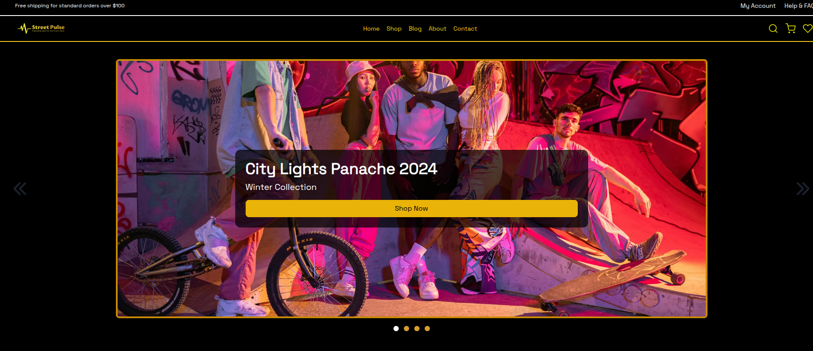
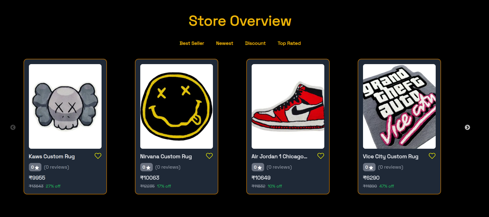

# StreetPulse

StreetPulse is a modern eCommerce platform built with Next.js, providing users with a seamless shopping experience. It includes features such as authentication, wishlist management, real-time reviews, and mock payments via Stripe.

## 🚀 Features
- **Authentication** (NextAuth) & Reset Password
- **Wishlist & Cart Management** (Add/Remove Products)
- **Blog Section** (Add/Remove Comments)
- **Product Reviews & Ratings** (Real-time Updates)
- **Checkout with Stripe** (Mock Payments)
- **Product Search & Filtering**
- **Responsive Design**

## 🌍 Live Demo

Check out the live version of StreetPulse here:
🔗 **[StreetPulse Live](https://street-pulse.vercel.app/)**

## 🛠 Tech Stack
- **Frontend:** Next.js, MUI, Zustand
- **Backend:** Next.js API Routes
- **Authentication:** NextAuth
- **Payments:** Stripe (Mock Payments)
- **State Management:** Zustand
- **Deployment:** Vercel

## 📦 Installation
1. Clone the repository:
   ```sh
   git clone https://github.com/yourusername/streetpulse.git
   cd streetpulse
   ```
2. Install dependencies:
   ```sh
   npm install
   ```
3. Set up environment variables in a `.env.local` file:
   ```sh
   NEXTAUTH_SECRET=your_nextauth_secret
   NEXTAUTH_URL=your_nextauth_url
   DATABASE_URL=your_database_url
   CLOUDINARY_NAME=your_cloudinary_name
   CLOUDINARY_API_KEY=your_cloudinary_api_key
   CLOUDINARY_API_SECRET=your_cloudinary_api_secret
   EMAIL_USER=your_email_user
   EMAIL_PASS=your_email_password
   STRIPE_SERVER_KEY=your_stripe_server_key
   NEXT_PUBLIC_STRIPE_CLIENT_KEY=your_stripe_client_key

   ```
4. Run the development server:
   ```sh
   npm run dev
   ```
5. Open [http://localhost:3000](http://localhost:3000) in your browser.

## 📸 Screenshots





## 🚀 Deployment
The application is deployed on **Vercel**. To deploy your own version:
1. Push your changes to GitHub.
2. Connect your repository to Vercel.
3. Set up environment variables on Vercel.
4. Deploy and get a live link.

## 📜 License
This project is open-source and available under the MIT License.

## 🙌 Contributing
Feel free to contribute by opening an issue or submitting a pull request.

## 📞 Contact
For any inquiries or feedback, reach out to me via [jasshwant.jvs@protonmail.com].

